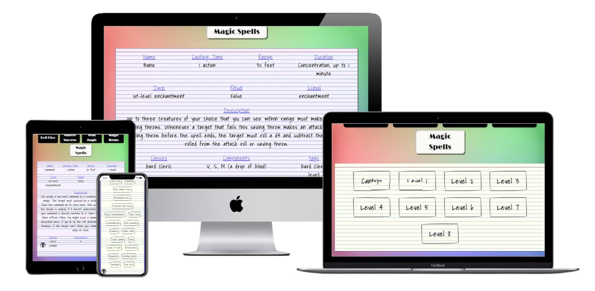

# Welcome to DM Tool!
## Introduction
This project is designed to be a Dungeon Master’s (DM) cheat sheet for Dungeons and Dragons (DND) 5th edition (5e). The original idea was to help a DM quickly reference spells and have access to various tables with as few clicks as possible, thus keeping the game moving forward.

With over 380 spells and growing, DND's 5th version is a cornucopia of spell casting information. Much more than a single person can easily keep up with. This application is designed for any DM that forgot to note exactly what a spell does, needs, or how it functions. Detailed information is provided for every spell and all spells can be looked up by level.

Multiple extra tables are provided for DM’s including Wild Magic, Magic Items, and Success at Cost tables. Not all tables are Rules As Written (RAW) and are simply there to change the flow and keep the game interesting. One of these extra tables, Dice, is for quick rolls or for strange/rare rolls including D50, D100, or D400.

## Technical Introduction
This project is a PERN (PostgreSQL, Express.js, React.js, Node.js) stack and has a sister deployment for its RESTful API. The RESTful API can be found at (https://github.com/Richardaeld/dm_tool_api) and does not require tokens for get requests currently, however this may change in the future.

# UX
## User Stories
### Common Users
+ I want to look up a spell.
	+ I opened the home page of DM Tool and waited for it to load. I clicked on the **Spells** button and was prompted to select a **level**. I know **Acid Splash** is a cantrip or a level 0 spell so I selected **Cantrip**.  I saw **Acid Splash** in the list and clicked its button. The application generated the entire spell and gave me all the information I needed.
+ I want to roll a virtual die.
	+ I opened the home page of DM Tool and waited for it to load. I clicked on the **Dice** button and was prompted to select the die I wanted to roll. I clicked on the **D20** and the program displayed the roll outcome.
+ I want to roll on a wild magic table.
    + I opened the home page of DM Tool and waited for it to load. I clicked on the **Spells** button and was prompted to select a table of **Rules as Written** or **House Rules**. I selected **House Rules** and was quickly met with my roll and its outcome.

 ### Admin
+ I want to add a new spell.
    + I am a selected admin that the developer has chosen. I opened my Insomnia application and created a POST request with all the necessary information. I added my admin token to the header content of my request. Finally, I added the IP address of the POST location for spells and clicked send. The name and id of the new spell are posted to the Insomnia console.
+ I want to look up all spells.
    + I am a selected admin that the developer has chosen. I opened my Insomnia application and created a GET request. I know I do not need a token because this is not a POST, PUT, PATCH, or DELETE request. I added the IP address for the get request and clicked the send button. The names and ids of all spells are printed out on the Insomnia console.
+ I want to edit a spell.
    + I am a selected admin that the developer has chosen. I opened my Insomnia application and created a PATCH request with all the necessary information. I added my admin token to the header content of my request. Finally, I added the IP address of the PATCH location for spells and clicked send. All of the spell’s information was posted to the Insomnia console.
+ I want to delete a spell.
    + I am a selected admin that the developer has chosen. I opened my Insomnia application and created a DELETE request. I added my admin token to the header content of my request. Finally, I added the IP address of the DELETE location for spells and clicked send. The id of the deleted spell was posted to the Insomnia console.

## Design Choices
### Page body
### Interaction
###Outputs

## Wireframes and Live Application
### Wire Frames

### Live Application

## Scalability

# Technology used
+ HTML - Skeleton frame of the application.
+ CSS - Beautifies the skeleton (HTML).
+ JavaScript - Allows for user interaction and dynamic function on the application. This also allows all the backend functions to work because of the runtime application Node.js.
+ Node.js – Runtime application that allows JS to be used outside of a browser.
+ PostgreSQL – Relational Database used.
+ Express.js – Backend web framework used with Node.js for server framework.
+ Knex.js – ORM (object-relational mapper) used to make SQL queries easier and faster to write.

# Testing
# Bugs and Other Problems
# Deployment
## GitHub
## Heroku
# Tools and Credits
## Tools
## Credits

