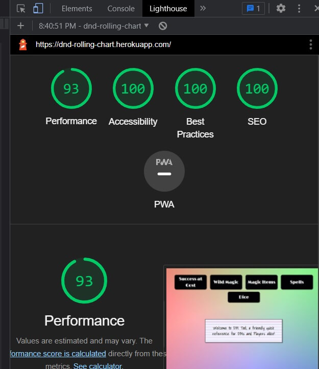
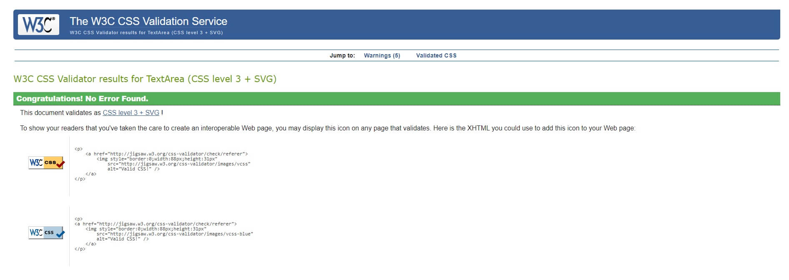
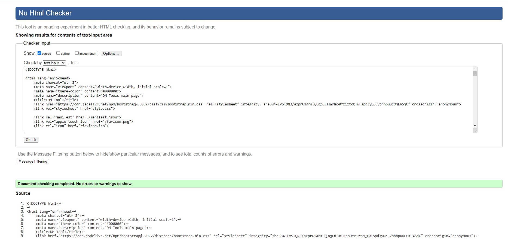
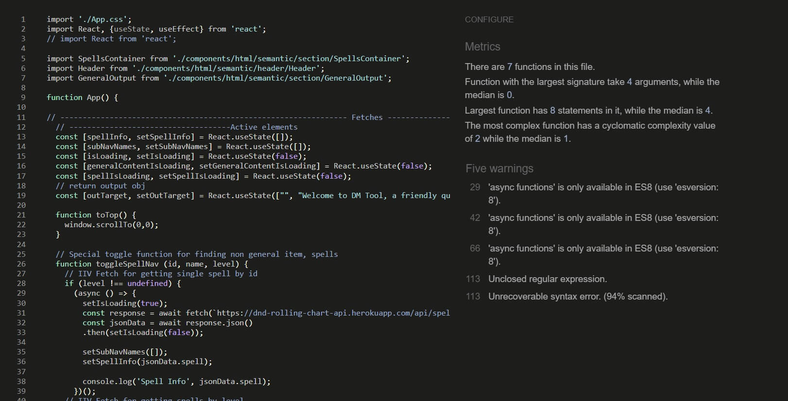

# Welcome to DM Tool!
## Introduction
This project is designed to be a Dungeon Master’s (DM) cheat sheet for Dungeons and Dragons (DND) 5th edition (5e). The original idea was to help a DM quickly reference spells and have access to various tables with as few clicks as possible, thus keeping the game moving forward.

With over 380 spells and growing, DND's 5th version is a cornucopia of spell casting information. Much more than a single person can easily keep up with. This application is designed for any DM that forgot to note exactly what a spell does, needs, or how it functions. Detailed information is provided for every spell and all spells can be looked up by level.

Multiple extra tables are provided for DM’s including Wild Magic, Magic Items, and Success at Cost tables. Not all tables are Rules As Written (RAW) and are simply there to change the flow and keep the game interesting. One of these extra tables, Dice, is for quick rolls or for strange/rare rolls including D50, D100, or D400.

## Technical Introduction
This project is a PERN (PostgreSQL, Express.js, React.js, Node.js) stack and has a sister deployment for its RESTful API. The RESTful API can be found at (https://github.com/Richardaeld/dm_tool_api) and does not require tokens for get requests currently, however this may change in the future.

# UX
## User Stories
### Common Users
+ I want to look up a spell.
    + I opened the home page of DM Tool and waited for it to load. I clicked on the **Spells** button and was prompted to select a **level**. I know **Acid Splash** is a cantrip or a level 0 spell so I selected **Cantrip**.  I saw **Acid Splash** in the list and clicked its button. The application generated the entire spell and gave me all the information I needed.
+ I want to roll a virtual die.
    + I opened the home page of DM Tool and waited for it to load. I clicked on the **Dice** button and was prompted to select the die I wanted to roll. I clicked on the **D20** and the program displayed the roll outcome.
+ I want to roll on a wild magic table.
    + I opened the home page of DM Tool and waited for it to load. I clicked on the **Spells** button and was prompted to select a table of **Rules as Written** or **House Rules**. I selected **House Rules** and was quickly met with my roll and its outcome.

 ### Admin
+ I want to add a new spell.
    + I am a selected admin that the developer has chosen. I opened my Insomnia application and created a POST request with all the necessary information. I added my admin token to the header content of my request. Finally, I added the IP address of the POST location for spells and clicked send. The name and id of the new spell are posted to the Insomnia console.
+ I want to look up all spells.
    + I am a selected admin that the developer has chosen. I opened my Insomnia application and created a GET request. I know I do not need a token because this is not a POST, PUT, PATCH, or DELETE request. I added the IP address for the get request and clicked the send button. The names and ids of all spells are printed out on the Insomnia console.
+ I want to edit a spell.
    + I am a selected admin that the developer has chosen. I opened my Insomnia application and created a PATCH request with all the necessary information. I added my admin token to the header content of my request. Finally, I added the IP address of the PATCH location for spells and clicked send. All of the spell’s information was posted to the Insomnia console.
+ I want to delete a spell.
    + I am a selected admin that the developer has chosen. I opened my Insomnia application and created a DELETE request. I added my admin token to the header content of my request. Finally, I added the IP address of the DELETE location for spells and clicked send. The id of the deleted spell was posted to the Insomnia console.

## Design Choices
### Page body
+ The page design was kept as close to pencil and paper themed as possible.
+ A multiple-colored gradient background was used to keep with DND’s all-inclusive feeling.
### Interaction
+ All common user interactions are simple clicks and do not require any logins. 
+ All common user interactions are designed to be accomplished in as little time as possible. 
+ All admin interactions are hidden behind the use of a 3rd party program to keep the program simple and remove the need for cumbersome login service when it is not needed.
### Outputs
+ All outputs are designed to look as if they were written as DM notes and thus a tablet or phone could be passed around the table for the same effect as a DM passing an actual note.

## Wireframes and Live Application
### Wireframes
+ The wireframes for this PERN stack version of DM Tool are the original site. The RAW code of which can be viewed under the MASTER branch and was created a year before this version. 

### Live Application

+ A live version of the Application can be viewed at: https://dnd-rolling-chart.herokuapp.com/

## Scalability
+ A login could be added for admins to help speed up accessibility to the database.
+ A login could be used to allow users to create their own spell and table lists to have a refined view of the material they use
+ Additional searches or refined parameters could be added to spells to allow players/DMs to look up spells based on what classes can use the spells, what spells are available per magic school, etc….

# Technology used
+ HTML - Skeleton frame of the application.
+ CSS - Beautifies the skeleton (HTML).
+ JavaScript - Allows for user interaction and dynamic function on the application. This also allows all the backend functions to work because of the runtime application Node.js.
+ Node.js – Runtime application that allows JS to be used outside of a browser.
+ PostgreSQL – Relational Database used.
+ Express.js – Backend web framework used with Node.js for server framework.
+ Knex.js – ORM (object-relational mapper) used to make SQL queries easier and faster to write.

# Testing
## Developer Testing Specifications
### Developer Testing Systems
+ Windows 10 (Chrome 87**, Edge 87**, Firefox 84**)
    + Chrome
        + Developed in Chrome.
        + Initially tested in every bootstrap breakpoint during development.
        + Tested in landscape, which is desktop responsiveness level.
        + Tested in portrait, which is tablet responsiveness level.
    + Edge
        + Tested in landscape, which is desktop responsiveness level.
        + Tested in portrait, which is tablet responsiveness level.
    + Firefox
        + Tested in landscape, which is desktop responsiveness level.
        + Tested in portrait, which is tablet responsiveness level.
+ G8 ThinQ (Chrome 87**)
    + Chrome
        + Tested in landscape, which is tablet responsiveness level.
        + Tested in portrait, which is mobile responsiveness level.
+ iPad, 5th gen 13.3(Safari 13**)
    + Safari
        + Tested in landscape, which is tablet responsiveness level.
        + Tested in portrait, which is tablet responsiveness level.

### Developer Testing Methods
+ Each **Developer Test** was performed on the above listed systems and the specified screen orientations.
+ The tester will perform all **Developer Tests** three times:
    + Once in landscape.
    + Once in portrait.
    + Once with random moments of spam clicking and switching between landscape/portrait. This final test is critical to ensure tablet and mobile users have an enjoyable experience.

### Developer Testing User Story Testing
    + All User Stories were tested by a developer with the developer specifications.
 
## Automated Testing
## Program Tests

### Lighthouse
+ Identifies problems with performance, accessibility, best practices, and SEO.

### JigSaw
+ Identifies errors in CSS

### W3C Validator
+ Identifies errors in HTML.
+ Helpful for proper semantic HTML and ARIA standard practices.

### JSHint
+ Identifies errors in JS.

# Bugs and Other Problems
+ There is a double iteration loop that can be seen in the console however, it does not seem to affect the application. Attempts have been made to trace this issue however, none have proved successful.

# Deployment
## GitHub
+ Go to the location of the original repository in GitHub, [https://github.com/Richardaeld/DND_Into_The_Abyss/tree/pern_convert]( https://github.com/Richardaeld/DND_Into_The_Abyss/tree/pern_convert).
+ Click on the **Code** button to get the drop-down menu.
+ Copy the HTTPS address provided.
+ Create a new GitHub/GitPod project (to house the new clone) and then open this new project.
+ Go to the Bash and type, `git clone <HTTPS>`, paste the HTTPS address found in the GitHub page (don't forget the space after "clone") and press enter.
+ A clone will be created within a new folder called " DND_Into_The_Abyss " (name of the original repository).
+ Unpack everything from this new folder to the root of the GitPod project tree and the foundation of the project will be setup.

## Heroku
+ Log into Heroku.
+ Create a new app on Heroku by clicking **New** and following the directions.

### Select a Buildpack
+ From the Heroku dashboard click **Settings**.
+ Select **Add buildpack**.
+ Select **Node.js** and click **save changes**.

### Link Heroku and GitHub:
+ Log into Heroku.
+ From the **Personal Apps** page, click on the new app that was just created in Heroku.
+ Click on **Deploy**.
+ Click on **GitHub** from **Deployment Method** section.
+ Enter your GitHub information and the name of the cloned repository into the "Connect to GitHub" section.

### Create a Postgres SQL Server.
+ From your new apps base page, click on **Resources**.
+ Click on **Find More Add-Ons**.
+ Select **Postgres**.
+ Finish setup.

### Enable Automatic Deployment or Manually Deploy Updates.
+ Automatic Deployment:
    + Click on **Deploy**.
    + Click on **Enable Automatic Deploys** in **Automatic Deploys** section.
    + Click on **Deploy Branch** in **Manual Deploy** section to start initial deployment.
+ Manual Deployment:
    + Click on **Deploy Branch** in **Manual Deploy** section any time there is content you want to update the active app with.

# Tools
+ [Adobe Color Wheel](https://color.adobe.com/create/color-wheel)
    + Used to help pick color schemes.
+ [Bootstrap](https://getbootstrap.com/)
    + Used as framework.
+ [GitHub](https://github.com/)
    + Used for version control and deploys application information to Heroku.
+ [Google Fonts](https://fonts.google.com/)
    + Imported font families found here.
+ [Heroku](https://www.heroku.com/)
    + Site where application is deployed.
+ [Jigsaw (Validation Service)](https://jigsaw.w3.org/css-validator/)
    + Used to identify errors in CSS.
+ [JSHint](https://jshint.com/)
    + Used to identify errors in JavaScript.
+ [JSON formatter](https://jsonformatter.org/)
    + Used to read long strings of JSON
+ [Lighthouse](https://developers.google.com/web/tools/lighthouse)
    + Used to check for performance, accessibility, best practices, and SEO.
+ [Techsini](https://techsini.com/multi-mockup/)
    + Used for their viewable responsiveness PNG.
+ [TinyPNG](https://tinypng.com/)
    + Used to Minimize KB load per image.
+ [VSCode](https://code.visualstudio.com/)
    + Integrated development environment used.
+ [W3C Validator](https://validator.w3.org/)
    + Used to identify errors in markup.

# Acknowledgements

